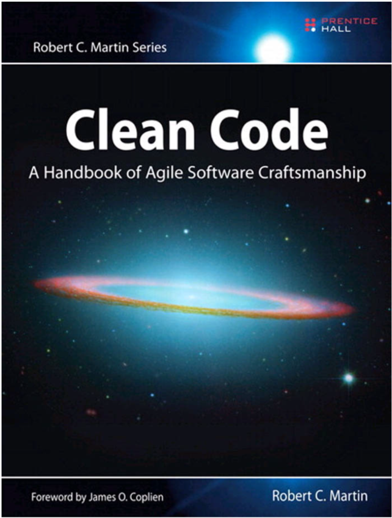

<!-- .slide: class="chapter-rev" -->
<!-- .element: data-visibility="hidden" -->
# Introduction

* <a href="#/dirty-character"> Dirty code characteristics </a>
* <a href="#/when-dirty"> When to write dirty code </a>
* <a href="#/why-keep-clean"> Why keep the code clean </a>
* <a href="#/programming-code"> Programming and code </a>
<!-- * <a href="#/clean-meaning"> Meanig of "clean code"</a> -->
* <a href="#/clean-character">Clean code characteristics</a>
* <a href="#/code-quality">Code quality measurement</a>
* <a href="#/boy-scout">The Boy Scout Rule</a>


---

# Introduction

<!-- <h2 style="margin-top: 20px;">Auto-Animate</h2> -->
<div class="r-hstack justify-center">
    <div class="r-vstack justify-center">
        <!-- .element: data-id="box1" style="background: cyan; width: 150px; height: 100px; margin: 5px; -->
        <div class="justify-center" data-id="box1" style="background: rgb(255, 255, 255); height: 100px; margin: 1px;">
            <blockquote>
                <p><strong>Author:</strong> Based on the book by Robert C. Martin (Uncle Bob) </p> 
                <p><strong>Title:</strong> Clean Code - A handbook of Agile Software Craftmanship </p>
            </blockquote>
        </div>
        <!-- <div data-id="box2" style="background: rgb(255, 255, 255); width: 150px; height: 100px; margin: 5px;"></div> -->
    </div>
    <!-- <div data-id="box3" style="background: yellow; width: 150px; height: 100px; margin: 1px;">
        
    </div> -->
    <div data-id="box2" style="background: rgb(255, 255, 255); width: 600px; height: 400px; margin: 1px;">
        
    </div>
</div>
<!-- <h2 style="margin-top: 20px;">Auto-Animate</h2> -->

inj-note:

Prezentacja będzie się opierać przede wszystkim na powyższj kiążce 

Czysty Kod - Podręcznik dobrego programisty
Robert C. Martin 

---

<!-- .slide: id="programming-code" -->

### Definition of programming and code

Specifying requirements in such detail that a machine can execute them is **_programming_**. Such a specification is **_code_**. 

Ref.: Clean Code, R.C. Martin<!-- .element: class="left-orient" -->

inj-note:

### Definicja programowania i kodu

Niemniej najpierw przedstawię kilka definicji. A więc definicja kodu i programowania,

Programowanie jest specyfikacją wymagań na takim poziomie szczegółowości, jaki maszyna może wykonać.
Kod zatem jest tą specyfikacją.

---

<!-- .slide: id="dirty-character" -->

### Dirty code characteristics

* dirty code: 

>(computing, derogatory) Software code that has had many editors with conflicting styles, making it nearly impossible to maintain. That software has dirty code and we should not use it.


Ref.: https://www.yourdictionary.com/dirty-code<!-- .element: class="left-orient" -->

inj-note:

### Czym sie charakteryzuje brudny kod

Wedlog slownika 'yourdictionary' brudny kod charakteryzuje sie, tym, ze to jest kod nad ktorym pracowalo
wielu programistow o roznych stylach programoania. Co powoduje, ze kod nie nadaje sie do utrzymywania
i dalszej pracy.

https://www.yourdictionary.com/dirty-code
https://en.wiktionary.org/wiki/dirty_code#:~:text=Noun,we%20should%20not%20use%20it.

---
<!-- .slide: id="when-dirty" -->

### When to write dirty code 

There are a few occasions where its okay to write dirty code: <!-- .element: class="left-orient" -->
1. When you’re stuck
2. When you want to write good code
3. When you want to make things quickly


Ref.: https://zellwk.com/blog/its-okay-to-write-dirty-code/<!-- .element: class="left-orient" -->

inj-note:

Czysty kod pochodzi z brudnego kodu, na takiej zasadzie jak sie przepisuje czystopis z brudnopisu,
albo tworzy sie obraz na podstaiw szkicu.

Wedlug powyzszego bloga, sa trzy przypadki gdy mozna pisac brudny kod.

1. Kiedy zaciales sie, nie wiesz jak isc dalej, i potrzebujesz prob aby rozwiazac problem,
2. Kiedy chcesz napisac czysty kod,
3. Kiedy musisz cos szybko napisac,


https://medium.com/@saad.eloulladi/write-clean-code-through-dirty-code-12a8b14b5e96
https://zellwk.com/blog/its-okay-to-write-dirty-code/

---

### When to write dirty code 

> [...]programming is a **craft** more than it is a **science**. To write **clean code**, you **must**
> first **write dirty code** and then clean it. [...] Most freshman programmers don’t follow this advice. 
> They believe that the primary goal is to get the program working. **Once it’s “working,”**
> **they move on to the next task**, leaving the “working” program in whatever state they finally got it to “work.” 
> Most seasoned programmers know that **this is professional suicide.**

― **Robert C. Martin**, Clean Code: A Handbook of Agile Software Craftsmanship

inj-note:

Aby pisać czysty kod, musimy na początku napisać brudny, a następnie go oczyścić. Zeby napisac dobry tekst,  najpierw pisze się zgrubny szkic, następnie drugi, a potem kilka kolejnych, aż otrzymamy ostateczną wersję.

Większość niedoświadczonych programistów nie stosuje się do tego zalecenia. Uważają oni, że ich podstawowym celem jest napisanie działającego programu. Gdy "już  to działa", to przechodzą do następnego zadania, pozostawiając ten "działający" program w dowolnym stanie. Większość doświadczonych programistów wie, że jest to zawodowe samobójstwo.

---

<!-- .slide: id="why-keep-clean" -->

### Why keep the code clean

>“**_Code is read much more often than it is written_**. Code should always be written in a way that promotes readability."

― **Guido van Rossum**, founder of Python, Python Enhancement Proposal (PEP 8)

```python
# see ZEN of Python in python console
import this
```

> “Indeed, the ratio of time spent **_reading versus writing is well over 10 to 1_**. We are 
> constantly reading old code as part of the effort to write new code. ...[Therefore,] making it 
> easy to read makes it easier to write.”

― **Robert C. Martin**, Clean Code: A Handbook of Agile Software Craftsmanship

inj-note:

Wedlug tworcy Pyhona kod jest czesciej czytany niz pisany, stad powinien byc pisany w taki sposob, ktory wspiera czytanie.

Sprawdzcie ZEN of Python, PEP 8 odwołuje sie do tych 19 wersow.

Wedlug wujka Boba, kod jest 10cio krotnie czesciej czytany niz pisany.

---

### Why keep the code clean

![pie_chart][pie_chart] <!-- .element: width="70%" height="auto" class="stretch"  style="float: right;" -->

[pie_chart]: ../markdowns/Images/01_Introduction/04.Pie_chart.PNG "Coding Activity" 

Ref.: https://dmitripavlutin.com/coding-like-shakespeare-practical-function-naming-conventions/

inj-note:

Według powyższej infografiki czytani kodu stanowi 75% czasu poświęcinego na pracę z nim.

Source of the picture
https://dmitripavlutin.com/coding-like-shakespeare-practical-function-naming-conventions/


---

### Why keep the code clean

The Cost of Owning a Mess is that: <!-- .element: class="left-orient" -->

> **_any change is not trivial._**


We’ve all said we’d go back and clean it up later. Those days we didn’t know LeBlanc’s law: <!-- .element: class="left-orient" -->

> **_Later equals never._**

Ref.: https://www.quora.com/What-resources-could-I-read-about-Leblancs-law


inj-note:

### Dlaczego nalezy utrzymywac kod czystym?

Podsumowując, pisząć brudny kod, trzeba mieć na uwadze, że:

Zadna zmiana nie jest trywialna, czyli łatwa do wprowadzenia.

Jesli mowimy, ze cos zrobimy pozniej, to najczesciej oznacza, ze nie zrobimy tego nigdy.

---

<!-- .element: data-visibility="hidden" -->
<!-- .slide: id="clean-meaning" -->

### Meanig of "clean code"

> I like my code to be **_elegant_** and **_efficient_**. The logic should be straightforward to make it hard
> for bugs to hide, the dependencies minimal to ease maintenance, **_error handling complete_**
> according to an articulated strategy, and performance close to optimal so as not to tempt
> people to make the code messy with unprincipled optimizations. Clean code **_does one thing well_**.

― **Bjarne Stroustrup**, *inventor of C++* and author of The C++ Programming Language

---

<!-- .element: data-visibility="hidden" -->
### Meanig of "clean code"

> Clean code is **_simple and direct_**. Clean code reads like **_well-written prose_**. 
> Clean code never obscures the designer's intent but rather is full of crisp 
> abstractions and straightforward lines of control.

― **Grady Booch**, author of Object Oriented Analysis and Design with Applications

---

<!-- .element: data-visibility="hidden" -->
### Meanig of "clean code"

> I could list all of the qualities that I notice in clean code, but there is one overarching 
> quality that leads to all of them. 
> Clean code always **_looks like it was written by someone who cares_**.
> There is nothing obvious that you can do to make it better. All of those things were thought
> about by the code's author, and if you try to imagine improvements, you're led back to
> where you are, sitting in appreciation of the code someone left for you code left by someone
> who cares deeply about the craft. 

― **Michael Feathers**, author of Working Effectively with Legacy Code

---

<!-- .element: data-visibility="hidden" -->
### Meanig of "clean code"

> I focus mostly on **_duplication_**. When the same thing is done over and over,
> it's a sign that there is an idea in our mind that is not well represented in the code.
> **_Expressiveness_** to me includes **_meaningful names_**, and I am likely to change the 
> names of things several times before I settle in.  (...) Expressiveness goes beyond names, 
> however. I also look at whether an object or method is doing more than one thing. If it’s an 
> object, it probably needs to be broken into two or more objects. 
> If it’s a method, I will always use the Extract Method refactoring on it, resulting 
> in one method that says more clearly what it does, and some submethods saying how it is done.
> **_Duplication and expressiveness_** take me a very long way into what I consider clean code, and 
> improving dirty code with just these two things in mind can make a huge difference. (...)
> I will often wrap the particular implementation in a more **_abstract method or class_**. That gives
> me a couple of interesting advantages. (...) all the references to that search are covered by 
> my little abstraction, I can  change the implementation any time I want. I can go forward 
> quickly while preserving my ability to change later.
> **_Reduced duplication, high expressiveness, and early building of simple abstractions_**.
> That’s what makes clean code for me.

― **Ron Jeffries**, author of Extreme Programming Installed and Extreme Programming Adventures in C#

---

<!-- .slide: id="clean-character" -->
### Clean code characteristics

<div class="r-hstack justify-center">
<div class="padded" style="width: 40%; text-align: left; justify-content: left;">
    <p style="text-align: left; justify-content: left">- elegant,</p>
    <p style="text-align: left; justify-content: left">- efficient,</p>
    <p style="text-align: left; justify-content: left">- complete error handling,</p>
    <p style="text-align: left; justify-content: left">- does one thing well,</p>
    <p style="text-align: left; justify-content: left">- simple and direct,</p>
    <p style="text-align: left; justify-content: left">- well-written prose,</p>

</div>

<div class="padded" style="width: 60%; text-align: left; justify-content: right;">
    <p style="text-align: left; justify-content: left">- written by someone who cares,</p>
    <p style="text-align: left; justify-content: left">- reduced duplications (copy & paste),</p>
    <p style="text-align: left; justify-content: left">- high expressiveness (including meaningful names),</p>
    <p style="text-align: left; justify-content: left">- early building of simple abstractions, abstract method or class,</p>
    <p style="text-align: left; justify-content: left">- test driven development (unit tests related),</p>
</div>
</div>

inj-note:

### Charakterystyka czystego kodu

- elegancki,
- wydajny,
- posiadający pełną obsługę błędów,
- odpowiada za jedną rzecz i robi ją dobrze,
- prosty i bezpośredni,
- dobrze napisana proza,
- napisany przez kogos, komu zależy,
- zminimalizowana ilość duplikacji,
- duża wyrazistość,
- bazowanie na abstrakcjacj, interface, klasy abstrakcyjne i metody,
- tdd, pisanie testow jednostkowych,


---

<!-- .slide: id="code-quality" -->
### Code quality measurement

It's been measured by WTF quantity per minute:<!-- .element: class="left-orient" -->

![code_qc][code_qc] <!-- .element: width="50%" height="auto" class="stretch"  style="float: right;" -->

[code_qc]: ../markdowns/Images/01_Introduction/03.WTF.PNG "Code quality" 


inj-note:

### Pomiar jakości kodu

Zwyczajowo mierzy się ilością łotdefaków na minutę, dobiegających z pokoju, w którym jest review.

---

<!-- .slide: id="boy-scout" -->
### The Boy Scout Rule

The Boy Scouts of America have a simple rule that we can apply to our profession:<!-- .element: class="left-orient" -->

> "**Leave the campground cleaner than you found it.**"

The cleanup doesn't have to be something big. Change one variable name for the better, break up one function that's a little too large, eliminate one small bit of duplication.

inj-note:

### Zasada skautów amerykańskich / harcerzy

Skauci amerykańscy mają prostą zasadę, jaką można zastosować w naszym zawodzie.

**Pozostaw obozowisko czyściejszym, niż go zastałes**.

Czyszczenie nie musi być duże. Wystarczy zmiana jednej nazwyzmiennej na lepszą, podział funkcji, czy eliminacja duplikacji.

Nie wystarczy dobrze pisać kod. Kod musi być zachowany w czystości przez cały czas.

